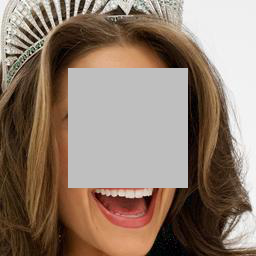
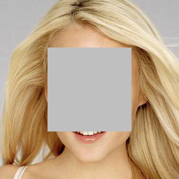
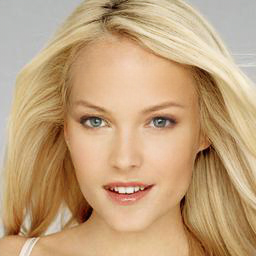
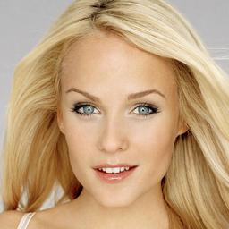
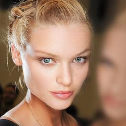

# Architecutre
 

# Shift layer
 

# Why no pretrain models ?
It is because the code is still in active development, making pretrained models broken from time to time.

Just pull the latest code and train by following the instructions.

# I just train a model for center face inpainting.
I select the first 2k images in CelebaHQ_256 for testing, the rest are for training.
```
python train.py --loadSize=256 --batchSize=1 --name='celeb256' --which_model_netG='unet_shift_triple' --niter=30 --datarooot='./datasets/celeba-256/train'
```
Mention: `loadSize` should be `256` for face datasets.

 
 
 
 

For testing, please read the documnent carefully.

## Prerequisites
- Linux or Windows.
- Python 2 or Python 3.
- CPU or NVIDIA GPU + CUDA CuDNN.
- Tested on pytorch >= 1.0

## Getting Started
### Installation
- Install PyTorch and dependencies from http://pytorch.org/
- Install python libraries [visdom](https://github.com/facebookresearch/visdom) and [dominate](https://github.com/Knio/dominate).

```bash
pip install visdom
pip install dominate
```
- Clone this repo:
```bash
git clone https://github.com/Zhaoyi-Yan/Shift-Net_pytorch
cd Shift-Net_pytorch

```

## Train models
- Download your own inpainting datasets.

- Train a model:
Please read this paragraph carefully before running the code.

Usually, we train/test `navie shift-net` with `center` mask.

```bash
python train.py --batchsize=1 --use_spectral_norm_D=1 --which_model_netD='basic' --mask_type='center' --which_model_netG='unet_shift_triple' --model='shiftnet' --shift_sz=1 --mask_thred=1
```
We offer you with 4 variants, in which **res patch soft shift-net** is recommended. It delivers **better performance** than the `navie shift-net` with light extra computation, and is able to handle with **both universial inpainting and face inpainting**.

For `res patch soft shift-net`:
```bash
python train.py --batchSize=1 --which_model_netG='res_patch_soft_unet_shift_triple' --model='res_patch_soft_shiftnet' --shift_sz=3 --mask_thred=4
```
For some datasets, such as `CelebA`, some images are smaller than `256*256`, so you need add `--loadSize=256` when training, **it is important**.

- To view training results and loss plots, run `python -m visdom.server` and click the URL http://localhost:8097. The checkpoints will be saved in `./log` by default.


**DO NOT** set batchsize larger than 1 for `square` mask training, the performance degrades a lot(I don't know why...)

For `random mask`(`mask_sub_type` is NOT `rect`), the batchsize can be larger than 1 without hurt of performance.

For training random mask, you need to train the model by setting
`mask_type='random'` and also `mask_sub_type='rect'` or `mask_sub_type='island'`.


### Extra variants

**These 3 models are just for fun**

For `res navie shift-net`:
```bash
python train.py --which_model_netG='res_unet_shift_triple' --model='res_shiftnet' --shift_sz=1 --mask_thred=1
```

For `pixel soft shift-net`:
```bash
python train.py --which_model_netG='soft_unet_shift_triple' --model='soft_shiftnet' --shift_sz=1 --mask_thred=1
```

For `patch soft shift-net`:
```bash
python train.py --which_model_netG='patch_soft_unet_shift_triple' --model='patch_soft_shiftnet' --shift_sz=3 --mask_thred=4
```

DO NOT change the shift_sz and mask_thred. Otherwise, it errors with a high probability.

For `patch soft shift-net` or `res patch soft shift-net`. You may set `fuse=1` to see whether it delivers better results(Mention, you need keep the same setting between training and testing).


## Test the model

**Keep the same settings as those during training phase to avoid errors or bad performance**

For example, if you train `patch soft shift-net`, then the following testing command is appropriate.
```bash
python test.py --fuse=1/0 --which_model_netG='patch_soft_unet_shift_triple' --model='patch_soft_shiftnet' --shift_sz=3 --mask_thred=4 
```
The test results will be saved to a html file here: `./results/`.


## Masks can be loaded offline or generated online
It now supports both online-generating and offline-loading for training and testing.
We generate masks online by default, however, set `--offline_loading_mask=1` when you want to train/test with your own prepared masks.
The prepared masks should be put in the folder `--training_mask_folder` and `--testing_mask_folder`.

### Masks when training
For each batch, then:
 - Generating online: masks are the same for each image in a batch.(To save computation)
 - Loading offline: masks are loaded randomly for each image in a batch.

### Masks when testing
For now, we assume that each mask has the name of corresponding image + a suffix of '_mask.png'.
We design in this way as it is eaier for comparion between different models.
You can generate masks yourself under the section **Testing models on given masks**.

If you want to test images with offline raomdom-loaded masks, you may do yourself.
It should be easy for you to write by yourself.

### Testing models on given masks
You should firstly generate masks by running `generate_masks.py`, we assume that only `mask_type=random`, then it makes sense to generate masks by yourself.
Make sure that you should **keep the same setting with what you train the model** when generating masks.
It means that you when you train the model with `mask_type='random'` and `mask_sub_type='island'`, then keep the same setting when generating masks using this `generate_masks.py`.
It generates masks with the names by adding a suffix of `_mask.png` to corresponding names of testing images.
Then set `offline_loading_mask=1` when testing, the program will read corresponding masks when testing.

## Performance degrades when batchsize > 1
-^_^, I trying to solve it...
A very strange thing is that if the `batchSize>1`, then the performance degrades.
I wonder whether it is due to some incompatibility of IN with UNet.
I will try to solve this problem.

## Kindly remindier
If you find it a little hard to read the code, you may read [Guides](https://github.com/Zhaoyi-Yan/Shift-Net_pytorch/blob/master/guides.md).


## New things that I want to add
- [x] Make U-Net handle with inputs of any sizes.
- [x] Update the code for pytorch >= 1.0.
- [x] Guides of our code, we hope it helps you understand our code more easily.
- [x] Add more GANs, like spectural norm and relativelistic GAN.
- [x] Boost the efficiency of shift layer.
- [x] Directly resize the global_mask to get the mask in feature space.
- [x] Visualization of flow. It is still experimental now.
- [x] Extensions of Shift-Net. Still active in absorbing new features.
- [x] Fix bug in guidance loss when adopting it in multi-gpu.
- [x] Add composit L1 loss between mask loss and non-mask loss
- [x] Finish optimizing soft-shift.
- [x] Add mask varaint in a batch.
- [x] Support Online-generating/Offline-loading prepared masks for training/testing.
- [x] Add VGG loss and TV loss
- [ ] Try different network architecture. As current UNet suffers from many problems.
- [ ] Fix performance degradance when batchsize is larger than 1.


## Citation
If you find this work useful or gives you some insights, please cite:
```
@InProceedings{Yan_2018_Shift,
author = {Yan, Zhaoyi and Li, Xiaoming and Li, Mu and Zuo, Wangmeng and Shan, Shiguang},
title = {Shift-Net: Image Inpainting via Deep Feature Rearrangement},
booktitle = {The European Conference on Computer Vision (ECCV)},
month = {September},
year = {2018}
}
```

## Acknowledgments
We benefit a lot from [pytorch-CycleGAN-and-pix2pix](https://github.com/junyanz/pytorch-CycleGAN-and-pix2pix)
