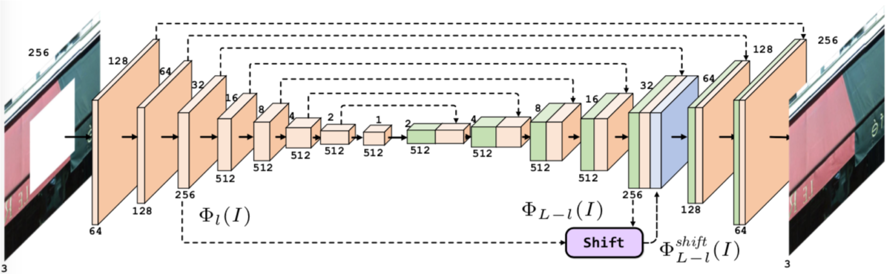
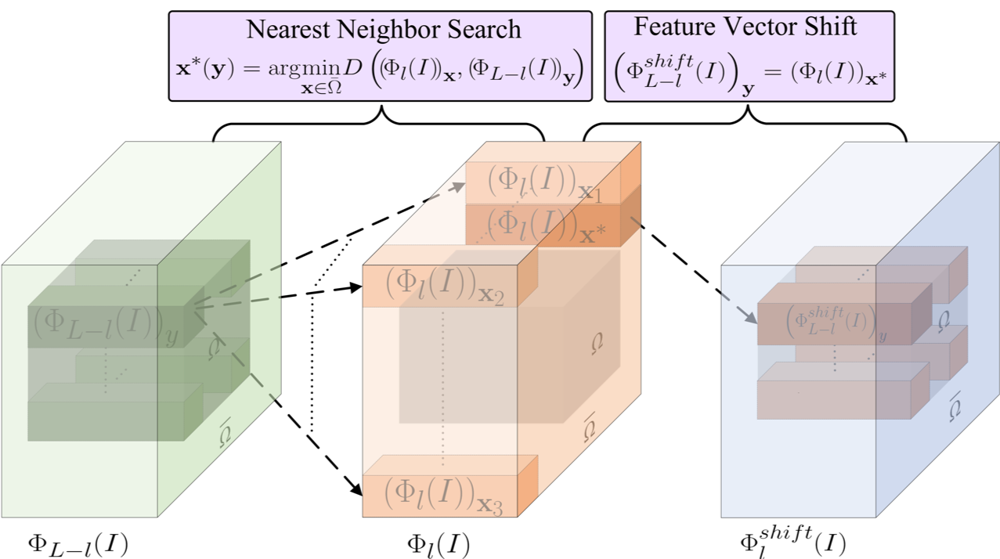

# Architecutre
 

# Shift layer
 

# Shift-Net_pytorch
This repositity is our Pytorch implementation for Shift-Net, it is just for those who are interesting in our work and want to get a skeleton Pytorch implemention. The original code is https://github.com/Zhaoyi-Yan/Shift-Net.

## Prerequisites
- Linux or Windows.
- Python 2 or Python 3.
- CPU or NVIDIA GPU + CUDA CuDNN.
- Tested on pytorch >= 0.4.0

## Getting Started
### Installation
- Install PyTorch and dependencies from http://pytorch.org/
- Install python libraries [visdom](https://github.com/facebookresearch/visdom) and [dominate](https://github.com/Knio/dominate).
```bash
pip install visdom
pip install dominate
```
- Clone this repo:
```bash
git clone https://github.com/Zhaoyi-Yan/Shift-Net_pytorch
cd Shift-Net_pytorch

```

### tain and test
- Download your own inpainting datasets.

- Train a model:

For navie shift-net:
```bash
python train.py --which_model_netG='unet_shift_triple' --model='shiftnet' --shift_sz=1 --maskA_thred=1
```

For pixel soft shift-net:
```bash
python train.py --which_model_netG='soft_unet_shift_triple' --model='soft_shiftnet' --shift_sz=1 --maskA_thred=1
```

For patch soft shift-net:
```bash
python train.py --which_model_netG='patch_soft_unet_shift_triple' --model='patch_soft_shiftnet' --shift_sz=3 --mask_thred=4
```
DO NOT change the shift_sz and mask_thred. Otherwise, it errors with a high probability.

- To view training results and loss plots, run `python -m visdom.server` and click the URL http://localhost:8097. The checkpoints will be saved in `./log` by default.

- Test the model

Keep the same settings as those when training to avoid errors.
```bash
python test.py
```
The test results will be saved to a html file here: `./results/`.

If you find this work useful, please cite:
```
@InProceedings{Yan_2018_Shift,
author = {Yan, Zhaoyi and Li, Xiaoming and Li, Mu and Zuo, Wangmeng and Shan, Shiguang},
title = {Shift-Net: Image Inpainting via Deep Feature Rearrangement},
booktitle = {The European Conference on Computer Vision (ECCV)},
month = {September},
year = {2018}
}
```

## Mention Multi-GPU usage
I suggest you not to try to run the code on multi-gpu. It will only degrade your performance and the training speed slows down.
If you insist on doing that, set 'opt.skip=1'.

## Kindly remindier
If you find it a little hard to read the code, you may read [Guides](https://github.com/Zhaoyi-Yan/Shift-Net_pytorch/blob/master/guides.md).


## New things that I want to add
- [x] Make U-Net handle with inputs of any sizes. (By resizing the size of features of decoder to fit that of the corresponding features of decoder.
- [x] Update the code for pytorch >= 0.4.
- [x] Clean the code and delete useless comments.
- [x] Guides of our code, we hope it helps you understand our code more easily.
- [x] Add more GANs, like spectural norm and relativelistic GAN.
- [x] Boost the efficiency of shift layer.
- [x] Directly resize the global_mask to get the mask in feature space.
- [x] Visualization of flow. It is still experimental now.
- [ ] Fix bug in guidance loss when adopting it in multi-gpu.
- [ ] Extensions of Shift-Net, which will help the performance a lot.
- [ ] Add random batch of masks
- [ ] Add soft transition from centered mask to random ones
- [ ] Add composit L1 loss between mask loss and non-mask loss
- [ ] Finish optimizing soft-shift
- [ ] Evaluate imagenet pre-trained models as discriminator

## Acknowledgments
We benefit a lot from [pytorch-CycleGAN-and-pix2pix](https://github.com/junyanz/pytorch-CycleGAN-and-pix2pix)
