# Architecutre
 

# Shift layer
 

## Prerequisites
- Linux or Windows.
- Python 2 or Python 3.
- CPU or NVIDIA GPU + CUDA CuDNN.
- Tested on pytorch >= 1.0

## Getting Started
### Installation
- Install PyTorch and dependencies from http://pytorch.org/
- Install python libraries [visdom](https://github.com/facebookresearch/visdom) and [dominate](https://github.com/Knio/dominate).

```bash
pip install visdom
pip install dominate
```
- Clone this repo:
```bash
git clone https://github.com/Zhaoyi-Yan/Shift-Net_pytorch
cd Shift-Net_pytorch

```

# Trained models
Usually, I would like to suggest you just pull the latest code and train by following the instructions.

However, for now, several models have been trained and uploaded.

| Mask | Paris | CelebaHQ_256 |
| ----     | ----    | ---- |
| center-mask | ok | ok |
| random mask(from **partial conv**)| ok | ok |

For CelebaHQ_256 dataset:
I select the first 2k images in CelebaHQ_256 for testing, the rest are for training.
```
python train.py --loadSize=256 --batchSize=1 --name='celeb256' --which_model_netG='unet_shift_triple' --niter=30 --datarooot='./datasets/celeba-256/train'
```
Mention: **`loadSize` should be `256` for face datasets, meaning direct resize the input image to `256x256`.**

The following some results on celebaHQ-256 and Paris.

Specially, for training models of random masks, we adopt the masks of **partial conv**(only the masks of which the ratio of masked region is 20~30% are used.)

 <table style="float:center">
 <tr>
  <th><B>Input</B></th> <th><B>Results</B></th> <th><B>Ground-truth</B></th>
 </tr>
 <tr>
  <td>
   
  </td>
  <td>
  
  </td>
  <td>
   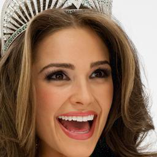
  </td>
  </tr>

  <tr>
  <td>
   
  </td>
  <td>
  
  </td>
  <td>
   
  </td>
  </tr>

  <tr>
  <td>
   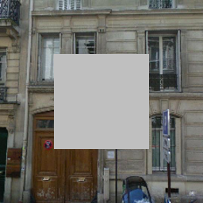
  </td>
  <td>
  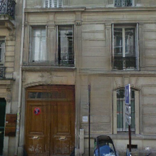
  </td>
  <td>
   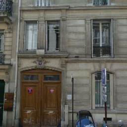
  </td>
  </tr>

<tr>
  <td>
   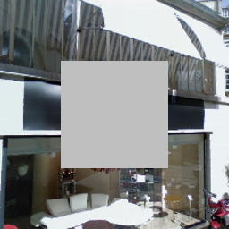
  </td>
  <td>
  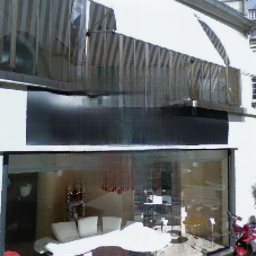
  </td>
  <td>
   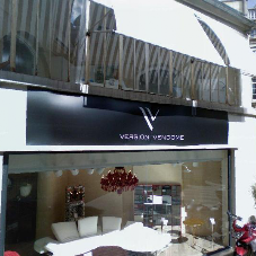
  </td>
  </tr>

<tr>
  <td>
   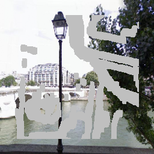
  </td>
  <td>
  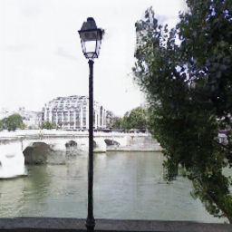
  </td>
  <td>
   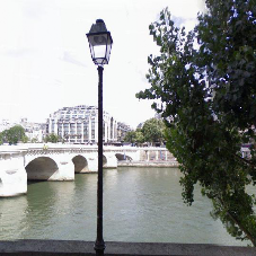
  </td>
  </tr>

<tr>
  <td>
   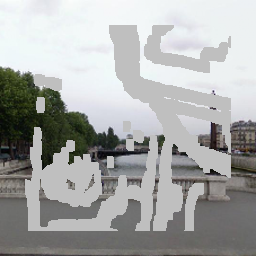
  </td>
  <td>
  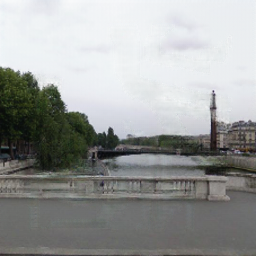
  </td>
  <td>
   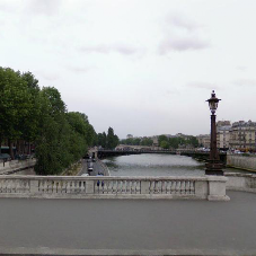
  </td>
</tr>


 </table>

For testing, please read the documnent carefully.

Pretrained model for face center inpainting are available:
```bash
bash download_models.sh
```
Rename `face_center_mask.pth` to `30_net_G.pth`, and put it in the folder `./log/face_center_mask_20_30`(if not existed, create it)
```bash
python test.py --which_model_netG='unet_shift_triple' --model='shiftnet' --name='face_center_mask_20_30' --which_epoch=30
```
Similarity, for paris random inpainting, rename `paris_random_mask_20_30.pth` to `30_net_G.pth`, and put it in the folder `./log/paris_random_mask_20_30`(if not existed, create it)
Then test the model:
```
python test.py --which_epoch=30 --name='paris_random_mask_20_30' --offline_loading_mask=1 --testing_mask_folder='masks' --dataroot='./datasets/celeba-256/test' --norm='instance'
```
Mention, your own masks should be prepared in the folder `testing_mask_folder` in advance.

For other models, I think you know how to evaluate them.
For models trained with center mask, make sure `--mask_type='center' --offline_loading_mask=0`.


## Train models
- Download your own inpainting datasets.

- Train a model:
Please read this paragraph carefully before running the code.

Usually, we train/test `navie shift-net` with `center` mask. 

```bash
python train.py --batchsize=1 --use_spectral_norm_D=1 --which_model_netD='basic' --mask_type='center' --which_model_netG='unet_shift_triple' --model='shiftnet' --shift_sz=1 --mask_thred=1 
```

For some datasets, such as `CelebA`, some images are smaller than `256*256`, so you need add `--loadSize=256` when training, **it is important**.

- To view training results and loss plots, run `python -m visdom.server` and click the URL http://localhost:8097. The checkpoints will be saved in `./log` by default.


**DO NOT** set batchsize larger than 1 for `square` mask training, the performance degrades a lot(I don't know why...)
For `random mask`(`mask_sub_type` is NOT `rect`  or your own random masks), the training batchsize can be larger than 1 without hurt of performance.

Random mask training(both online and offline) are also supported. 

Personly, I would like to suggest you to loading the masks offline(similar as **partial conv**). Please refer to section **Masks**.

## Test the model

**Keep the same settings as those during training phase to avoid errors or bad performance**

For example, if you train `patch soft shift-net`, then the following testing command is appropriate.
```bash
python test.py --fuse=1/0 --which_model_netG='patch_soft_unet_shift_triple' --model='patch_soft_shiftnet' --shift_sz=3 --mask_thred=4 
```
The test results will be saved to a html file here: `./results/`.


## Masks
Usually, **Keep the same setting of masks of between training and testing.**
It is because the performance is highly-related to the masks your applied in training.
The consistency of training and testing masks are crucial to get good performance.

| training | testing |
| ----     | ----    |
| center-mask | center-mask |
| random-square| All |
| random | All|
| your own masks| your own masks|

It means that if you taining a model with `center-mask`, then test it usin
### Training by online-generating marks
We offer three types of online-generating masks: `center-mask, random_square and random_mask`.
If you want to train on your own masks silimar like **partial conv**, ref to **Training on your own masks**.


### Training on your own masks
It now supports both online-generating and offline-loading for training and testing.
We generate masks online by default, however, set `--offline_loading_mask=1` when you want to train/test with your own prepared masks.
**The prepared masks should be put in the folder `--training_mask_folder` and `--testing_mask_folder`.**

### Masks when training
For each batch, then:
 - Generating online: masks are the same for each image in a batch.(To save computation)
 - Loading offline: masks are loaded randomly for each image in a batch.

## Using Switchable Norm instead of Instance/Batch Norm
For fixed mask training, `Switchable Norm` delivers better stableness when batchSize > 1. **Please use switchable norm when you want to training with batchsize is large, much more stable than instance norm or batchnorm!**

## Kindly remindier
If you find it a little hard to read the code, you may read [Guides](https://github.com/Zhaoyi-Yan/Shift-Net_pytorch/blob/master/guides.md).

### Extra variants

**These 4 models are just for fun**

For `res patch soft shift-net`:
```bash
python train.py --batchSize=1 --which_model_netG='res_patch_soft_unet_shift_triple' --model='res_patch_soft_shiftnet' --shift_sz=3 --mask_thred=4
```

For `res navie shift-net`:
```bash
python train.py --which_model_netG='res_unet_shift_triple' --model='res_shiftnet' --shift_sz=1 --mask_thred=1
```

For `pixel soft shift-net`:
```bash
python train.py --which_model_netG='soft_unet_shift_triple' --model='soft_shiftnet' --shift_sz=1 --mask_thred=1
```

For `patch soft shift-net`:
```bash
python train.py --which_model_netG='patch_soft_unet_shift_triple' --model='patch_soft_shiftnet' --shift_sz=3 --mask_thred=4
```

DO NOT change the shift_sz and mask_thred. Otherwise, it errors with a high probability.

For `patch soft shift-net` or `res patch soft shift-net`. You may set `fuse=1` to see whether it delivers better results(Mention, you need keep the same setting between training and testing).


## New things that I want to add
- [x] Make U-Net handle with inputs of any sizes.
- [x] Update the code for pytorch >= 1.0.
- [x] Guides of our code, we hope it helps you understand our code more easily.
- [x] Add more GANs, like spectural norm and relativelistic GAN.
- [x] Boost the efficiency of shift layer.
- [x] Directly resize the global_mask to get the mask in feature space.
- [x] Visualization of flow. It is still experimental now.
- [x] Extensions of Shift-Net. Still active in absorbing new features.
- [x] Fix bug in guidance loss when adopting it in multi-gpu.
- [x] Add composit L1 loss between mask loss and non-mask loss
- [x] Finish optimizing soft-shift.
- [x] Add mask varaint in a batch.
- [x] Support Online-generating/Offline-loading prepared masks for training/testing.
- [x] Add VGG loss and TV loss
- [x] Fix performance degradance when batchsize is larger than 1.
- [ ] Add gated conv(before 8.10)
- [ ] Try different network architecture. As current UNet suffers from many problems.


## Citation
If you find this work useful or gives you some insights, please cite:
```
@InProceedings{Yan_2018_Shift,
author = {Yan, Zhaoyi and Li, Xiaoming and Li, Mu and Zuo, Wangmeng and Shan, Shiguang},
title = {Shift-Net: Image Inpainting via Deep Feature Rearrangement},
booktitle = {The European Conference on Computer Vision (ECCV)},
month = {September},
year = {2018}
}
```

## Acknowledgments
We benefit a lot from [pytorch-CycleGAN-and-pix2pix](https://github.com/junyanz/pytorch-CycleGAN-and-pix2pix)
